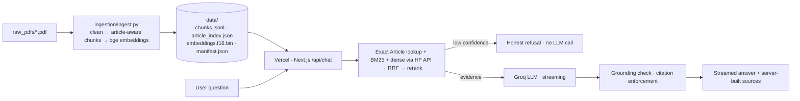

# Samvidhan·AI — Ask the Constitution

A student RAG chatbot that answers questions about the **Constitution of India** only from source PDFs, shows exact sources (book · PDF page · Article), and refuses honestly when the answer isn't there.

> ⚠️ Student learning project. Not legal advice. See [DISCLAIMER.md](DISCLAIMER.md).

_Screenshots: add `docs/light.png`, `docs/dark.png` here._

## Architecture

LINK : https://rag-chatbot-jiteshkushwaha.vercel.app/

File Structure 
```
rag-chatbot
├── data
│   ├── article_index.json
│   ├── chunks.jsonl
│   ├── embeddings.f16.bin
│   └── manifest.json
├── DISCLAIMER.md
├── ingestion
│   ├── article_parser.py
│   ├── books.config.json
│   ├── clean.py
│   ├── eval_questions.json
│   ├── ingest.py
│   └── requirements.txt
├── next.config.js
├── package.json
├── postcss.config.js
├── raw_pdfs
│   ├── book1.pdf
│   ├── book2.pdf
│   ├── book3.pdf
│   ├── book4.pdf
│   ├── book5.pdf
│   └── book6.pdf
├── README.md
├── scripts
│   └── eval.ts
├── src
│   ├── app
│   │   ├── api
│   │   │   ├── chat
│   │   │   │   └── route.ts
│   │   │   └── health
│   │   │       └── route.ts
│   │   ├── globals.css
│   │   ├── layout.tsx
│   │   └── page.tsx
│   ├── components
│   │   ├── AboutSheet.tsx
│   │   ├── ArticleBrowser.tsx
│   │   ├── Chakra.tsx
│   │   ├── Chat.tsx
│   │   ├── Composer.tsx
│   │   ├── DisclaimerModal.tsx
│   │   ├── EmptyState.tsx
│   │   ├── Message.tsx
│   │   ├── SourceSheet.tsx
│   │   └── ThemeToggle.tsx
│   ├── lib
│   │   ├── articleLookup.ts
│   │   ├── bm25.ts
│   │   ├── config.ts
│   │   ├── dense.ts
│   │   ├── fusion.ts
│   │   ├── groq.ts
│   │   ├── grounding.ts
│   │   ├── loadIndex.ts
│   │   ├── pipeline.ts
│   │   ├── prompt.ts
│   │   ├── queryRewrite.ts
│   │   ├── rateLimit.ts
│   │   ├── retrieve.ts
│   │   ├── sse.ts
│   │   ├── tokenize.ts
│   │   └── types.ts
│   └── styles
│       └── tokens.css
├── tailwind.config.ts
├── tests
│   ├── articleLookup.test.ts
│   ├── bm25.test.ts
│   ├── fixtures.ts
│   ├── grounding.test.ts
│   ├── query.test.ts
│   └── refusal.test.ts
├── tsconfig.json
├── vercel.json
└── vitest.config.ts
```

## Why not Ollama / FAISS / PyTorch on Vercel?
Vercel functions are capped at ~250 MB unzipped and short execution times. PyTorch + sentence-transformers alone exceed that, and Ollama needs a long-running GPU/CPU server. So embeddings are precomputed offline (Phase A). At runtime, retrieval is pure TypeScript; only the *query* is embedded through the Hugging Face Inference API (optional). Generation runs on Groq.

**Models:** Groq retired `llama-3.3-70b-versatile` / `llama-3.1-8b-instant` for free/developer tiers on 16 Aug 2026. Defaults are `openai/gpt-oss-120b` (primary) and `openai/gpt-oss-20b` (fallback). Verify current model IDs at https://console.groq.com/docs/models and override with `GROQ_MODEL` / `GROQ_FALLBACK_MODEL`.

## Notebook → module map
| Notebook cell | New location |
|---|---|
| PyPDFLoader (cell 2) | `ingestion/ingest.py` (PyMuPDF) |
| unicode cleaning (cell 3) | `ingestion/clean.py` |
| RecursiveCharacterTextSplitter (cell 4) | `ingestion/article_parser.py` |
| HuggingFaceEmbeddings + FAISS (cells 5–8) | `ingest.py → data/embeddings.f16.bin` + `src/lib/dense.ts` |
| retriever k=5 (cell 9) | `src/lib/retrieve.ts` (hybrid + article lookup) |
| LangGraph `retrieve` node | `src/lib/retrieve.ts` / `pipeline.ts` |
| ChatOllama + prompt + `generate` node | `src/lib/groq.ts` + `prompt.ts` |
| Source printing (cell 20) | server-built `sources` → `SourceSheet.tsx` |

## 1 · Build the index (laptop, once)
```bash
cd ingestion && python -m venv .venv && source .venv/bin/activate   # Windows: .venv\Scripts\activate
pip install -r requirements.txt
# put PDFs in ../raw_pdfs/ and edit books.config.json
python ingest.py --inspect      # prints first page of each book so you can classify them
python ingest.py                # builds ../data/*   (add --no-embed for BM25-only)
```
At the end, check the quality report. Each of `Article 21 / 21A / 32 / 14 / 368` should print **OK**. If any print MISSING, adjust `ARTICLE_RE` in `article_parser.py` (PDF dash characters vary).

## 2 · Run locally
```bash
npm install
cp .env.example .env.local      # paste GROQ_API_KEY (and optional HF_TOKEN)
npm run dev                     # http://localhost:3000
npm test                        # unit tests
npm run eval                    # retrieval/refusal metrics; npm run eval:llm adds grounding
```

## 3 · Deploy (GitHub → Vercel)
1. Create a GitHub repo (private if unsure about PDF copyright), commit everything **including `/data`**, never `.env*`.
2. Vercel → Add New Project → import repo (Next.js auto-detected).
3. Settings → Environment Variables: `GROQ_API_KEY` (https://console.groq.com/keys); optional `HF_TOKEN`, `GROQ_MODEL`, `GROQ_FALLBACK_MODEL`. Apply to Production + Preview, then redeploy.
4. Open `/api/health` → `ok: true`, chunk count, `mode`. Test: "What is Article 21?", "What is Article 32?", "Who can amend the Constitution?", "How far is Jupiter from Earth?".

**Troubleshooting:** *Function too large* → keep `/data` < 50 MB/file, don't commit PDFs into `src`. *Index not found* → `/data` not committed, or `outputFileTracingIncludes` was edited. *429* → Groq rate limit; wait or switch the fallback model. *CORS* → the API is same-origin only, by design. *Slow first answer* → cold start loads and indexes the data (~1–2 s); warm calls reuse the module cache.

**Security:** if your Groq key was ever pasted in a chat, screenshot, or commit, **rotate it** at the Groq console.

**Copyright:** only commit PDFs/derived text you have the right to publish. The Constitution's text is a government publication; commentary books usually are not free to republish. Keep the repo private if unsure.

## Evaluation targets (your learning loop)
| Metric | Target |
|---|---|
| retrieval hit-rate@7 | ≥ 90% |
| refusal accuracy (negatives) | 100% |
| grounding-flag rate | ≤ 10% |

Loop: run `npm run eval` → read the FAIL lines → fix chunking (`article_parser.py`), synonyms (`queryRewrite.ts`), or thresholds (`retrieve.ts`) → re-ingest if needed → re-run.

## Learning log
| # | Hallucination / failure found | Fix applied | Result |
|---|---|---|---|
| 1 | Top chunks were running headers (`THE CONSTITUTION OF INDIA(Part V…)4396`) | header regex + frequency stripping, min 120 useful chars, dedupe | headers no longer retrievable |
| 2 | Invented Article 21 & 32 text | one-Article-per-chunk + exact `article_index` pinning + quote-only format + grounding check | verbatim text cited [1] |
| 3 | "Page X / Page 4396" from the LLM | LLM forbidden to write sources; server builds them from metadata | pages always real |
| 4 | Fundamental Rights → Article 14 only | BM25 + dense + concept synonyms + RRF + MMR | diverse, relevant passages |
| 5 | Jupiter question sent to LLM | intent guard + confidence gate (no LLM on low evidence) | instant refusal |
| 6 | PDF index vs printed page confusion | store `pdf_page` + detected `printed_page` | "PDF p. N" shown |
| 7 | Hindi cover / mixed scripts | NFKC, drop Devanagari-dominant pages from index, Devanagari fonts in UI | clean English index |

## Limitations & future work
Cross-encoder reranker (e.g. bge-reranker); multilingual Hindi retrieval; reliable printed-page citations; RAGAS evaluation; a durable rate limiter (Upstash) instead of per-instance memory; better amendment/omission tracking.
